# TMUG — Technical Architecture

This document outlines the authentic system architecture, technology stack, directory organization, state management, and component hierarchy of the TMUG web platform.

---

## Technology Stack

The application is built on a modern, high-performance web stack:

| Layer | Technology | Version | Purpose |
| :--- | :--- | :--- | :--- |
| **Framework** | Next.js (App Router) | `16.3.8` | Server-side rendering, static generation, file-based routing |
| **Core UI Library** | React | `19.2.8` | Component rendering, concurrent UI transitions |
| **Language** | TypeScript | `^5.0.0` | Strict type safety across product models, store, and props |
| **Styling** | Tailwind CSS v4 | `^4.0.0` | Utility-first CSS via `@tailwindcss/postcss` and `@theme` tokens |
| **Animation Engine** | Framer Motion | `^14.0.0` | Orchestrated UI motion, spring physics, and layout animations |
| **Fonts** | Next Google Fonts | Built-in | `Bricolage Grotesque` (display) and `DM Sans` (body) |
| **Package Manager** | npm | `10.x+` | Dependency lifecycle management |
| **Deployment Target**| Vercel / Node.js | Next-native | Edge edge-caching, serverless route handlers, static asset CDN |

---

## System Directory Organization

```
tmug-website/
├── data/
│   └── site-controls.json      # Persistent JSON storage for draft, published & snapshot history
├── public/                     # Static public assets served from root
│   ├── assets/
│   │   └── stickers/           # SVG botanical, badge, and doodle stickers
│   ├── banners/                # High-resolution campaign banners (1-6)
│   ├── hero/                   # High-res transparent PNG product packshots for 3D stage
│   ├── logo/                   # TMUG brand emblems and logomarks (tmug-logo.png)
│   ├── products/               # Master catalog JPG images (front, back, FSSAI views)
│   ├── favicon.ico
│   ├── icon.svg
│   └── og-cover.jpg            # Open Graph social sharing banner (1200x630)
├── src/
│   ├── app/                    # Next.js App Router routes & layout definitions
│   │   ├── about/              # Brand origin & founder story
│   │   ├── admin/              # Complete Website Visual Control Center
│   │   │   ├── components/     # Modular admin inputs (ColorField, TypographyField, HoverEffectField, LivePreviewPane)
│   │   │   └── page.tsx        # Comprehensive Admin Control Center dashboard
│   │   ├── admin/seo/          # Admin SEO management console
│   │   ├── api/admin/auth/     # Admin authentication endpoint
│   │   ├── api/admin/seo/      # REST API route handler for dynamic SEO updates
│   │   ├── api/admin/site-controls/ # Admin CRUD for draft/publish/history/rollback
│   │   ├── api/admin/upload/   # Real media file upload handler
│   │   ├── api/site-controls/  # Public site controls with authenticated ?preview=draft
│   │   ├── collections/        # Filterable collection browsing view
│   │   ├── contact/            # Customer care & wholesale inquiry page
│   │   ├── faq/                # Brewing, shipping & return questions
│   │   ├── privacy/            # Legal privacy notice
│   │   ├── products/           # Dynamic product detail pages ([slug])
│   │   ├── terms/              # Terms & conditions
│   │   ├── globals.css         # Global Tailwind v4 theme, keyframes, and utilities
│   │   ├── layout.tsx          # Root layout, Google fonts, JSON-LD Schema, DynamicThemeProvider, SiteControlsProvider
│   │   ├── page.tsx            # Main storefront entry point with ItemList schema
│   │   ├── robots.ts           # Dynamic crawlers instruction file
│   │   ├── sitemap.ts          # XML Sitemap generator for SEO
│   │   └── template.tsx        # View transition page wrapper
│   ├── components/             # Reusable UI components hooked into useSiteControls()
│   │   ├── cart/               # AddToCartButton, Toast notification system
│   │   ├── motion/             # Framer Motion primitives (Reveal, FloatingLogo)
│   │   ├── AnnouncementBar.tsx # (Exported from Header.tsx) Site announcement strip
│   │   ├── AvailableInStores.tsx# Verified retail and marketplace channels
│   │   ├── BestSellers.tsx     # Compact best sellers showcase
│   │   ├── BrandProof.tsx      # Social proof, community metrics, press citations
│   │   ├── CartDrawer.tsx      # Fixed portal slide-over cart & WhatsApp checkout
│   │   ├── CustomerLove.tsx    # Customer reviews and testimonials
│   │   ├── DynamicThemeProvider.tsx # Injects dynamic CSS variables and Google Fonts
│   │   ├── FinalCta.tsx        # Closing conversion card & email newsletter
│   │   ├── Footer.tsx          # Sitewide footer and legal disclosures
│   │   ├── Header.tsx          # Global navigation, mobile menu, search trigger
│   │   ├── Hero.tsx            # Campaign slider with autoplay & visual controls
│   │   ├── HomeClient.tsx      # Client-side 14-section homepage orchestrator with section toggles
│   │   ├── icons.tsx           # SVG icon library (close, trash, search, bag, arrow, WhatsApp)
│   │   ├── LifestyleGallery.tsx# "Made for moments that linger" sticker composition
│   │   ├── MadeWithRealTea.tsx # Whole botanical ingredients transparency breakdown
│   │   ├── OpenRevealSection.tsx# Unboxing tea reveal experience
│   │   ├── ProductCard.tsx     # Standard product card with dynamic styling & hover presets
│   │   ├── ProductDetail.tsx   # Detailed product view (images, brew guide, ingredients)
│   │   ├── ProductQuickView.tsx# Modal quick-view overlay for rapid browsing
│   │   ├── SearchOverlay.tsx   # Live product search drawer with fuzzy matching
│   │   ├── ShopCollections.tsx # Multi-tab product slider with dynamic heading & colors
│   │   ├── SiteOverlays.tsx    # Container for CartDrawer, SearchOverlay, PromoModal
│   │   ├── TeaRitualsAndRecipes.tsx # Curated hot/cold brew recipes
│   │   ├── TeaStory.tsx        # Daily tea ritual timeline (Morning, Afternoon, Evening)
│   │   ├── TrustStrip.tsx      # Four-pillar botanical trust and shipping badge marquee
│   │   ├── WhatsAppButton.tsx  # Floating quick-chat concierge launcher
│   │   └── WhyTmug.tsx         # Brand value proposition & whole-leaf manifesto
│   ├── config/
│   │   ├── seo.ts              # Default SEO meta definitions
│   │   ├── site.ts             # Central site configuration, URLs, promo codes, WhatsApp links
│   │   └── site-controls.ts    # Canonical DEFAULT_SITE_CONTROLS definitions
│   ├── data/
│   │   ├── collections.ts      # Collection definitions, navigation hierarchy, product relations
│   │   ├── products.ts         # SINGLE SOURCE OF TRUTH for products, variants, and prices
│   │   └── reviews.ts          # Verified review entries
│   ├── lib/
│   │   ├── format.ts           # INR currency formatter (formatINR, formatMoney)
│   │   ├── seo-store.ts        # Server-side persistent SEO settings cache
│   │   ├── site-control-store.ts # Server-side persistent published/draft/history store
│   │   ├── site-controls-context.tsx # React Context provider with postMessage live preview
│   │   └── store.tsx           # React Context shop state (cart, promo codes, fly animation)
│   └── types/
│       ├── index.ts            # Master TypeScript re-exports
│       └── site-controls.ts    # Strict schemas for visual controls, global tokens & sections
```

---

## Website Visual Control Center Architecture

### 1. Store & State Flow

```mermaid
graph TD
    AdminUI[Admin Control Center UI] -->|POST save-draft| AdminAPI[/api/admin/site-controls]
    AdminUI -->|POST publish| AdminAPI
    AdminUI -->|postMessage| LivePreview[Live Preview Iframe]
    AdminAPI --> Store[site-control-store.ts]
    Store --> Disk[(data/site-controls.json)]
    Store --> InMemory[In-Memory Cache Fallback]
    LivePreview --> ClientCtx[SiteControlsProvider]
    ClientCtx --> DynTheme[DynamicThemeProvider]
    DynTheme --> Storefront[Storefront Sections & Components]
    PublicUser[Public Shopper] -->|GET /api/site-controls| PublicAPI[/api/site-controls]
    PublicAPI -->|Mode: published| Store
```

### 2. Dual Draft vs. Published Isolation
- **Published State**: Served to all public visitors via SSR initial props (`RootLayout`) and the public `/api/site-controls` endpoint.
- **Draft State**: Editable in the Admin Visual Control Center. Persisted separately in `data/site-controls.json`. Changes do not impact public users until "Publish All" is triggered.
- **Live Preview Sync**: Uses HTML5 `postMessage` cross-frame messaging to update the live preview iframe instantly on every keystroke/color picker change without page reloading or server roundtrips.
- **Snapshot History**: Every "Publish All" action captures an immutable snapshot into `state.history` (capped at 10 items). Operators can roll back to any historical snapshot with 1 click.
- **Dynamic CSS Variables & Typography**: `DynamicThemeProvider` reads active global design controls and injects `--brand-cream`, `--brand-terracotta`, `--brand-gold`, font family tokens, border radii, and dynamically loads Google Fonts stylesheets without manual CSS modifications.

---

## Homepage Component Architecture & Boundaries

The storefront homepage (`src/app/page.tsx` rendering `src/components/HomeClient.tsx`) coordinates 14 distinct visual and architectural layers:

```mermaid
graph TD
    A[RootLayout: layout.tsx] --> B[Home: page.tsx]
    B --> C[HomeClient.tsx]
    C --> D1[01. AnnouncementBar - Header.tsx]
    C --> D2[02. Header & Nav - Header.tsx]
    C --> D3[03. Hero Banner Slider - Hero.tsx & banners.ts]
    C --> D4[04. TrustStrip - TrustStrip.tsx]
    C --> D5[05. Shop by Product / Collections - ShopCollections.tsx]
    C --> D6[06. Best Sellers 50/50 Showcase - BestSellers.tsx]
    C --> D7[07. Open / Reveal Experience - OpenRevealSection.tsx]
    C --> D8[08. Why TMUG - WhyTmug.tsx]
    C --> D9[09. MadeWithRealTea - MadeWithRealTea.tsx]
    C --> D10[10. TeaStory - TeaStory.tsx]
    C --> D11[11. LifestyleGallery - LifestyleGallery.tsx]
    C --> D12[12. BrandProof - BrandProof.tsx]
    C --> D13[13. CustomerLove / Reviews - CustomerLove.tsx]
    C --> D14[14. AvailableInStores - AvailableInStores.tsx]
    C --> D15[15. FinalCta - FinalCta.tsx]
    C --> D16[16. Footer - Footer.tsx]
    C --> D17[17. SiteOverlays - SiteOverlays.tsx]
    D17 --> E1[CartDrawer.tsx]
    D17 --> E2[SearchOverlay.tsx]
    D17 --> E3[PromoModal.tsx]
    D17 --> E4[WhatsAppButton.tsx]
```



### Component Boundaries & Real Paths:
1. **AnnouncementBar**: `src/components/Header.tsx` (promotional strip in warm ivory/tea-gold, zero dark green UI)
2. **Header**: `src/components/Header.tsx` (sticky navigation in warm ivory/white, charcoal typography, gold accents)
3. **Hero**: `src/components/Hero.tsx` (storefront campaign banner slider consuming `src/config/banners.ts` and `public/banners/*`)
4. **TrustStrip**: `src/components/TrustStrip.tsx` (4-pillar marquee strip in soft warm surface)
5. **ShopCollections**: `src/components/ShopCollections.tsx` (full-width product rail with outer flank scroll arrows, 4-6 cards visible on desktop, soft Gen-Z hover glow)
6. **BestSellers**: `src/components/BestSellers.tsx` (compact, sleek 4-card D2C grid with transparent cutouts, live INR pricing, in-cart steppers)
7. **OpenRevealSection**: `src/components/OpenRevealSection.tsx` (pop-up product reveal occupying 45-65% vh, Framer Motion popup scale, controlled random product selection, live cart addition)
8. **WhyTMUG**: `src/components/WhyTmug.tsx` (brand differentiators with prominent packshot, flower watermark, zero green UI)
9. **MadeWithRealTea**: `src/components/MadeWithRealTea.tsx` (botanical ingredients inspection)
10. **TeaStory**: `src/components/TeaStory.tsx` (daily ritual timeline)
11. **Admin Media System**: `src/app/admin/MediaUploadField.tsx` & `src/app/api/admin/upload/route.ts` (native file picker, slot specs, dimension/transparency inspection, saves to `public/uploads/`)
11. **LifestyleGallery**: `src/components/LifestyleGallery.tsx` ("Made for moments that linger" sticker composition)
12. **BrandProof**: `src/components/BrandProof.tsx` (social proof counters and editorial quotes)
13. **CustomerLove**: `src/components/CustomerLove.tsx` (customer feedback & verified testimonials)
14. **AvailableInStores**: `src/components/AvailableInStores.tsx` (Amazon Brand Store & WhatsApp Concierge)
15. **FinalCTA**: `src/components/FinalCta.tsx` (closing newsletter & shop navigation)
16. **Footer**: `src/components/Footer.tsx` (legal navigation, FSSAI notice, contact information, social links)
17. **SiteOverlays**: `src/components/SiteOverlays.tsx` (CartDrawer with live quantity stepper + Remove, SearchOverlay, PromoModal)


---

## Product Data Architecture

The single source of truth for the entire product catalog is `src/data/products.ts`. All interfaces are defined in `src/types/index.ts`:

```typescript
export interface ProductImage {
  src: string;
  alt: string;
  kind: "front" | "back" | "fssai";
}

export interface ProductVariant {
  id: string;        // e.g. "butterfly-pea-50g-jar"
  sku: string;       // e.g. "TMUG-BUTTERFLY-PEA-50G-JAR"
  label: string;     // e.g. "50g Jar"
  weight: string;    // e.g. "50g"
  pack: "jar" | "pouch";
  price: number;     // Genuine selling price in INR (e.g. 99)
  images: ProductImage[];
  inStock: boolean;
}

export interface Product {
  id: string;
  slug: string;
  name: string;
  tagline: string;
  category: "herbal-flower" | "chai" | "green-tea";
  description: string;
  brewGuide: string;
  ingredients: string;
  profile: string;
  accent: string;
  accentSoft: string;
  featured?: boolean;
  seoTitle: string;
  metaDescription: string;
  variants: ProductVariant[];
}
```

### Active Catalog Summary:
- **Butterfly Pea Flower Tea** (`butterfly-pea`): 50g Jar (₹99), 100g Pouch (₹189)
- **Chamomile Flower Tea** (`chamomile`): 50g Jar (₹129), 100g Pouch (₹209)
- **Hibiscus Flower Tea** (`hibiscus`): 50g Jar (₹119), 100g Pouch (₹199)
- **Lemongrass Tea** (`lemongrass`): 50g Jar (₹99), 100g Pouch (₹199)
- **Darjeeling Green Tea** (`darjeeling-green`): 100g Jar (₹149)
- **TMUG Premium Tea** (`premium-tea`): 250g Pouch (₹299), 500g Pouch (₹449)
- **TMUG Gold Tea** (`gold-tea`): 250g Pouch (₹399), 500g Pouch (₹749)

---

## Slider & Carousel Architecture

The primary carousel on the homepage is `ShopCollections.tsx`:
1. **Category Tabs State**: `activeTab` filters `PRODUCTS` dynamically into the active list.
2. **Scroll Container**: Powered by a native horizontal scrolling container with CSS scroll snap (`scroll-snap-type: x mandatory`).
3. **Scroll Bounds Detection**: `checkScrollBounds` tracks `scrollLeft`, `scrollWidth`, and `clientWidth` to toggle arrow states (`canScrollLeft`, `canScrollRight`).
4. **Desktop Navigation**: Clicking left/right scroll buttons computes item width (`clientWidth * 0.75`) and performs smooth scrolling (`behavior: "smooth"`).
5. **Mobile Swipe**: Native touch deceleration with hidden scrollbars (`no-scrollbar`) ensures zero horizontal page blowout.
6. **No Cropping**: Each `ProductCard` utilizes `h-[260px]` to `h-[300px]` with `object-contain` for complete packaging visibility.

---

## State Management & Cart Architecture

State is centralized in `src/lib/store.tsx` via `ShopProvider`:
- **Cart Storage**: Hydrated lazily from `localStorage.getItem("tmug-cart-v1")`.
- **Coupon Handling**: Hydrated from `localStorage.getItem("tmug-coupon-v1")`. Validates against `siteConfig.promo` (Code: `TMUG10`, 10% discount).
- **Fly-to-Cart Animation**: `triggerFly` coordinates coordinates `(fromX, fromY)` to header bag `(toX, toY)` with Framer Motion spring physics.
- **Cart Drawer (`CartDrawer.tsx`)**: Rendered using `createPortal(children, document.body)` to avoid clipping inside parent stacking contexts. Adapts to a bottom sheet on mobile (`max-width: 639px`) and a slide-over panel on desktop.

---

## Checkout & WhatsApp Architecture

TMUG features a high-converting **direct-to-WhatsApp concierge checkout**:
1. When a user clicks **"Order on WhatsApp"** in `CartDrawer.tsx`, `whatsappOrderLink()` compiles:
   - Formatted item list (Name, Variant, Qty, Unit Price).
   - Subtotal in INR.
   - Applied coupon discount breakdown (e.g. `TMUG10 — 10% off`).
   - Final payable total.
2. Link generates an encrypted URL to `https://wa.me/918130707344?text=...`.
3. Customer confirms order directly with the TMUG fulfillment team.
4. A secondary **"Checkout"** button displays a friendly notice that direct gateway payment is coming soon while WhatsApp is the active immediate checkout avenue.

---

## Asset Architecture

All static assets reside under `/public/`:
- `/public/products/`: 31 authentic product packaging JPG photographs covering front, back, and FSSAI views.
- `/public/hero/`: 11 high-definition transparent PNG cutouts of jars and pouches for layered 3D scenes.
- `/public/assets/stickers/`: Handcrafted SVG brand stickers (`tea-leaf.svg`, `flower-doodle.svg`, `tea-cup.svg`, `sparkle.svg`, `arrow-doodle.svg`, `badge-kadak.svg`, `badge-natural.svg`).
- `/public/logo/`: Official brand identity files (`tmug-logo.png`).

---

## Animation & Motion Architecture

- **Framer Motion (`framer-motion`)**: Used for page reveals (`Reveal.tsx`), interactive floating cards, modal transitions, and cart line item exit animations.
- **Tailwind Theme Keyframes**:
  - `marquee`: Infinite linear 30s scroll for trust banners.
  - `float`: Smooth 7s vertical idle float.
  - `steam-rise`: Gentle steam rising effect above the kulhad cup.
  - `cup-float`: 6s subtle grounding float.
  - `bob`: 5s gentle product hovering.
- **Accessibility**: Automatically disabled when user prefers reduced motion via `@media (prefers-reduced-motion: reduce)` in `globals.css` and `useReducedMotion()`.

---

## Responsive Architecture

- Mobile-first approach utilizing Tailwind breakpoints:
  - `sm`: 640px (Small tablets & large phones)
  - `md`: 768px (Tablets)
  - `lg`: 1024px (Laptops / Small desktops)
  - `xl`: 1280px (Standard desktops)
  - `2xl`: 1536px (Large monitors)
- Fluid typography utilizing `clamp()` expressions:
  - `.text-hero`: `clamp(2.625rem, 7vw, 4.5rem)`
  - `.text-hero-xl`: `clamp(2.625rem, 9vw, 4.5rem)`
  - `.text-section`: `clamp(1.875rem, 4vw, 3rem)`
- `overflow-x: clip` on `body` guarantees zero side scrolling across all viewport widths.

---

## External Integrations

1. **Amazon Brand Store**:
   `https://www.amazon.in/stores/Tmug/page/4EF8CF60-EB4F-4438-B735-748BE0ED8162?lp_asin=B0H25XRHC5&ref_=ast_bln`
2. **WhatsApp Business Concierge**:
   `+91 81307 07344` (`https://wa.me/918130707344`)
3. **Structured Data (Schema.org)**:
   - `Organization` and `WebSite` JSON-LD in `layout.tsx`.
   - `ItemList` with product offers in `page.tsx`.

---

## Phase 2 Admin & Control Architecture

### 1. Routes & Control Dashboard
- `/admin/login` (`src/app/admin/login/page.tsx`): Authenticated gate using email and password, verified against server environment variables. Sets secure HTTP-only session cookie (`tmug-admin`).
- `/admin` (`src/app/admin/page.tsx`): Dashboard with 4 tabs:
  - **Hero Banners**: Live headline/subheading edits, CTA links, image paths, visibility toggles, reordering, and native file uploads.
  - **Products & Prices**: Live price editing in INR, compare-at pricing, image path adjustments, Best Seller/Popular Pick flags, and native media management.
  - **Collections**: Category names, descriptions, display toggles, reordering.
  - **Homepage Sections**: Section visibility, headings, subheadings, CTAs, order manipulation.
- `/admin/seo` (`src/app/admin/seo/page.tsx`): Dedicated metadata, open graph, canonical URL, and index controls.

### 2. Authentication Architecture & Security
- **Environment-Variable Based Authentication**: Server authentication in `/api/admin/auth` is strictly driven by server environment variables (`ADMIN_EMAIL` and `ADMIN_PASSWORD`).
- **Zero Plaintext Credentials in Source**: No credentials are ever hardcoded in application source code, client JavaScript bundles, or React components.
- **Session Management**: Successful authentication issues an HTTP-only, SameSite=lax session cookie (`tmug-admin`) with 12-hour expiration that guards `/admin`, `/admin/seo`, `/api/admin/site-controls`, and `/api/admin/upload`.
- **Environment Configuration**: Set `ADMIN_EMAIL` and `ADMIN_PASSWORD` in `.env.local` for local development, and in Vercel Project Environment Variables for production deployments.

### 3. API Endpoints
- `/api/admin/auth`: Handles login (`POST`), logout, and authentication status verification against `process.env`.
- `/api/admin/upload`: Multi-part image upload endpoint saving verified assets to `/public/uploads/`.
- `/api/admin/site-controls`: Returns current configuration (`GET`) and persists updates (`POST`).
- `/api/admin/seo`: Handles SEO settings management and validation.

### 4. Data Storage & Defaults
- Defaults configuration: `src/config/site-controls.ts`.
- File-based persistence engine: `src/lib/site-control-store.ts` targeting `data/site-controls.json` with safe server-side fallback.

