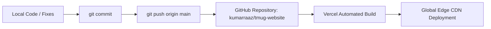

# TMUG — Deployment & Release Workflow

This document details the exact deployment lifecycle, build scripts, version control practices, production testing protocols, and security guidelines for the TMUG storefront.

---

## 1. Local Development

Commands as configured in `package.json`:

```bash
# Start local development server with Turbopack / Next dev
npm run dev

# Starts on http://localhost:3000
```

Environment variables are defined in `.env.example`:
- `NEXT_PUBLIC_SITE_URL`: Base canonical URL (defaults to `https://tmug.in` in production).

---

## 2. Production Build & Validation

The build pipeline enforces static compilation and strict type-checking across all App Router routes:

```bash
# Run linting check
npm run lint

# Compile production build
npm run build

# Start local production server to test compiled build
npm run start
```

### Build Verification Checklist
- Next.js builds cleanly with zero compile errors.
- TypeScript reports 0 type errors (`tsconfig.json`).
- Tailwind CSS v4 compiles design tokens via `@tailwindcss/postcss`.
- Static routes (`/about`, `/contact`, `/faq`, `/terms`, `/privacy`) and dynamic product pages (`/products/[slug]`) generate without hydration mismatches.

---

## 3. Git Version Control Workflow

### Verified Git Configuration
- **Active Branch**: `main`
- **Remote Name**: `origin`
- **Remote URL**: `https://github.com/kumarraaz/tmug-website.git`

### Standard Git Release Procedure
```bash
# 1. Verify working directory status
git status

# 2. Stage changes
git add .

# 3. Commit with concise semantic message
git commit -m "Update TMUG project documentation"

# 4. Push directly to the active branch (main)
git push origin main
```

> [!WARNING]
> Always verify the active branch with `git branch --show-current` prior to pushing. Never push directly to unverified remote targets.

---

## 4. Vercel Continuous Deployment

The repository is linked to Vercel for automated zero-downtime deployments:



1. **Trigger**: Pushes to `main` automatically initiate a Vercel production deployment.
2. **Framework Detection**: Vercel detects Next.js automatically and executes `npm run build`.
3. **Environment Injection**: Set production environment variables (e.g., `NEXT_PUBLIC_SITE_URL`) in the Vercel project dashboard.
4. **Instant Invalidation**: Static pages and Edge cached assets refresh across the global Vercel Edge network.

---

## 5. Production QA Protocol

Before accepting any production deployment, execute the following audit checklist:

- [ ] **Homepage Experience**: Hero 3D showcase renders, kulhad cup floats, and trust marquee scrolls continuously without jank.
- [ ] **Product Pages**: All 7 products open at `/products/[slug]` with functional variant selectors and accurate pricing.
- [ ] **Cart Flow**: Cart opens, increments/decrements quantity, calculates subtotals, and persists across browser refreshes via `tmug-cart-v1`.
- [ ] **Promo Codes**: Coupon `TMUG10` applies 10% discount in cart and updates final payable sum.
- [ ] **Checkout via WhatsApp**: "Order on WhatsApp" correctly launches WhatsApp with pre-filled multi-line order details to `+91 81307 07344`.
- [ ] **Navigation & Menus**: Desktop mega-dropdown and mobile navigation drawer open and close smoothly.
- [ ] **Amazon CTA**: Official store link correctly navigates to the verified Amazon Brand Store page.
- [ ] **Mobile Responsiveness**: Complete visual audit across 360px, 375px, 390px, 414px, and 430px screens.
- [ ] **Desktop Layout**: Balanced presentation and centered grid alignment across 1280px, 1440px, and 1920px viewports.
- [ ] **Console Errors**: Browser DevTools console must remain free of JavaScript exceptions, 404 image errors, or hydration warnings.
- [ ] **No Broken Images**: Every product image in `/public/products/` and `/public/hero/` loads with 200 HTTP status.
- [ ] **No Broken Links**: All internal anchors (`#shop`, `#collections`, `#why`, `#about`) and legal routes resolve properly.

---

## 6. Security & Credential Hygiene

- **Zero Secret Commits**: Never commit `.env.local`, API tokens, private SSH keys, or administrative passwords.
- **Client-Side Safety**: Ensure only variables prefixed with `NEXT_PUBLIC_` are referenced in client components.
- **Dependencies**: Periodically run `npm audit` to identify and patch vulnerable packages.
